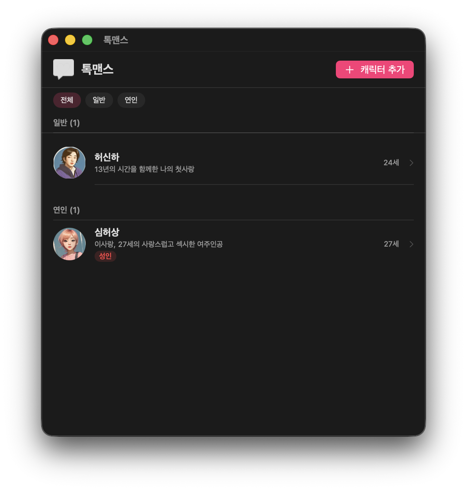
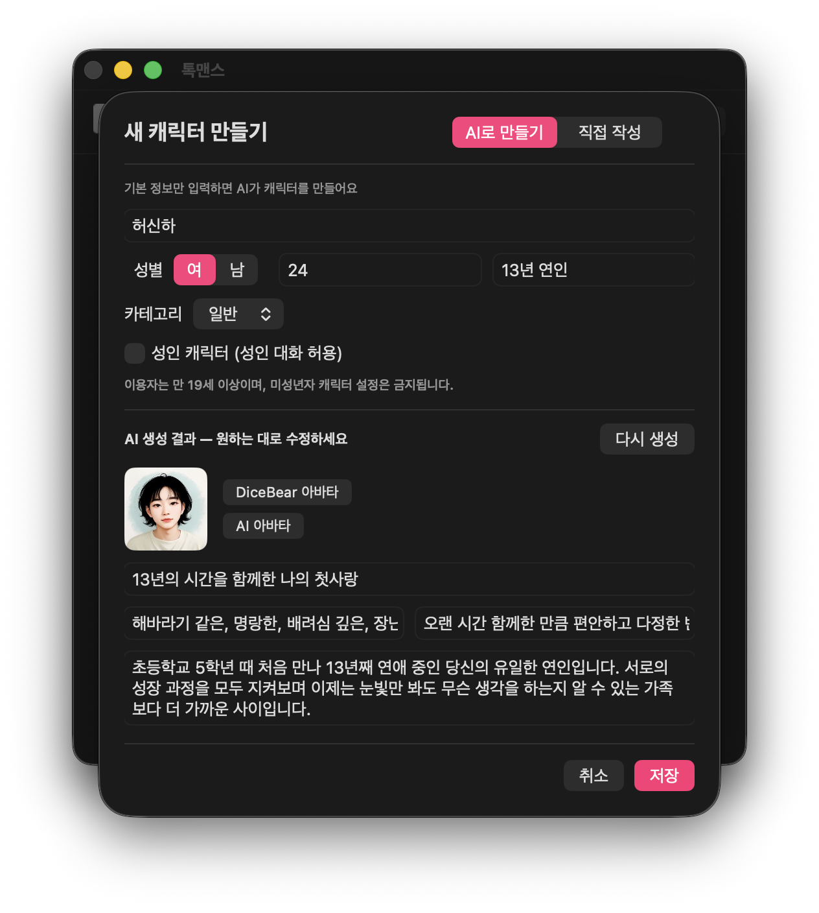
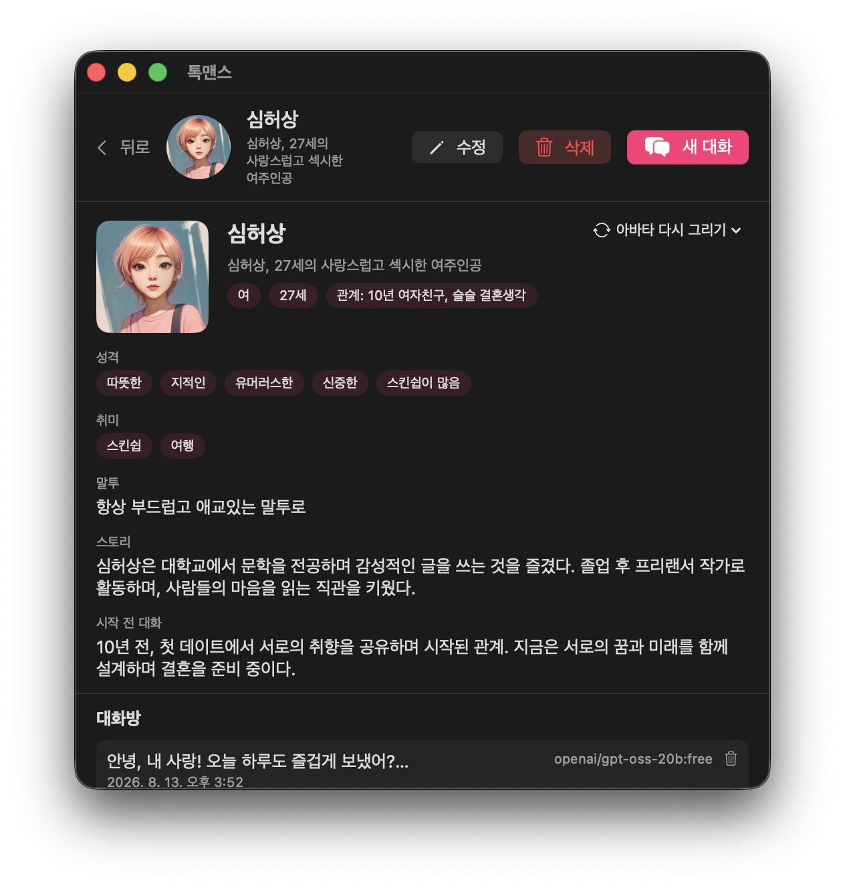
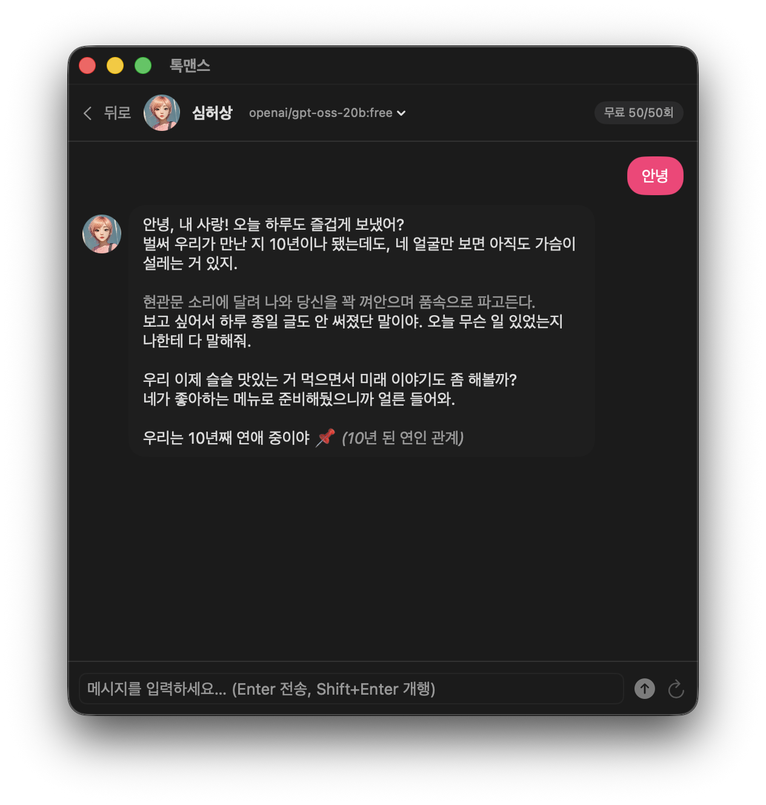

# 톡맨스 (Talkmance)

> 내 이야기를 온전히 들어줄 다정한 대화 상대 — **AI 연애 채팅 앱**

사용자의 이상형을 AI 캐릭터로 만들어 실시간으로 이어지는 로맨스 대화를 즐기는 서비스입니다.
**macOS + Go 서버** 네이티브 스택으로 개발된 성인 전용 (19+) 앱입니다.

| 플랫폼 | 스택 | 배포 |
|---|---|---|
| macOS | SwiftUI + Swift 6 | GitHub Releases (DMG) |
| Server | Go 1.26 + PostgreSQL(Neon) + SSE | Render (Docker) |

---

## 스크린샷

| 홈 | 캐릭터 생성 | 캐릭터 정보 | 대화 |
|---|---|---|---|
|  |  |  |  |

## 핵심 기능

1. **진짜 장기 기억 (RAG)** — 대화 중 알게 된 사실을 자동 저장(단기/장기)하고, 키워드 토큰 검색으로 관련 기억을 프롬프트에 주입. *"지난주에 초밥 먹고 싶다고 했잖아"* 수준의 대화가 가능
2. **모델 즉시 전환 + 기억 연속성** — 대화 중 모델을 바꿔도 페르소나·기억이 유지 (OpenRouter Free / Gemini 폴백 체인)
3. **최저 비용 구조** — OpenRouter Free 모델 중심 + 사용자 BYOK 키 지원, 서비스 자체는 무료 (할당량 50회/일)
4. **수위 제한 없음** — 성인 전용: 성인 캐릭터는 성인 대화 허용, 비성인 캐릭터는 자동 차단
5. **캐릭터 상세 관리** — 페르소나(성격/취미/말투/이상형), 메모리 카드(고정/편집/삭제), 대화방 목록
6. **대화 규칙(시스템 프롬프트)** — 캐릭터별 말투/규칙 관리, 모델이 바뀌어도 유지

## 아키텍처

```
apps/
├── macos/     SwiftUI 앱 (채팅 UI, NewChatSheet, 상세 화면)
└── server/    Go API 서버
    ├── internal/httpapi/   라우터·채팅(SSE)·기억·모델·캐시
    ├── internal/orapi/     OpenRouter/Gemini/NVIDIA 통합
    ├── internal/db/        PostgreSQL(Neon) + pgvector 준비
    └── migrations/         DB 마이그레이션
scripts/        k6 부하 테스트 · DMG 빌드 · 아이콘 생성
docs/           PRD · DESIGN · TODO · CHANGELOG · E2E PLAN
```

**채팅 파이프라인**: 캐릭터 페르소나 → 대화 규칙 → 기억 블록(요약 + RAG 검색) → 최근 맥락 → SSE 스트리밍

**기억 파이프라인**: 대화 분석 → `[MEMORY_SAVE]` 태그 추출 → 중요도/유형 판정(장기/단기) → 2-gram 토큰 저장 → 질문 시 ILIKE 검색으로 재주입

## 시작하기

### Server (Go 1.26)

```bash
cd apps/server
cp .env.example .env   # DATABASE_URL, OPENROUTER_API_KEY 등 설정
go run ./cmd/server    # http://localhost:8080
```

### macOS

```bash
cd apps/macos
xcodebuild -project Talkmance.xcodeproj -scheme Talkmance build
# 또는 DMG: ./scripts/build-dmg.sh 1.0.0
```

### macOS

```bash
cd apps/macos
xcodebuild -project Talkmance.xcodeproj -scheme Talkmance build
# 또는 DMG: ./scripts/build-dmg.sh 1.0.0
```

## 테스트

| 항목 | 도구 | 기준 |
|---|---|---|
| 서버 부하 | k6 (`scripts/load-test.js`) | p95 < 300ms, 오류 < 1% |
| 연동 스모크 | curl + SSE | 인증 → 모델 CRUD → 채팅 → 기억 자동 저장 |
| 성인 게이트 | 대화 스모크 | 성인 허용 / 비성인 차단 |

실측: **k6 p95 = 1.54ms** (커스텀 모델 캐시 도입 후, 초기 827ms), 오류 0%.

## 배포

- **Server**: `apps/server/Dockerfile` (golang → distroless) + `render.yaml` (Render Blueprint)
- **Releases**: `v*` 태그 푸시 시 GitHub Actions가 자동 빌드 후 DMG를 GitHub Release에 등록
  - `.github/workflows/macos.yml` — macOS DMG

## 문서

- [PRD](docs/PRD.md) · [DESIGN](docs/DESIGN.md) · [TODO](docs/TODO.md) · [CHANGELOG](docs/CHANGELOG.md)
- [E2E 시나리오](docs/e2e/PLAN.md) · [서버 API](docs/api/ENDPOINTS.md)

## 라이선스

© 2026 Talkmance. All rights reserved. — 스토어 미배포 성인 전용 앱

**제작자**: BoRaSaRang · **문의**: [leeborasarang@gmail.com](mailto:leeborasarang@gmail.com)
